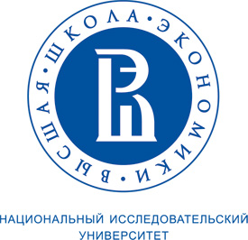
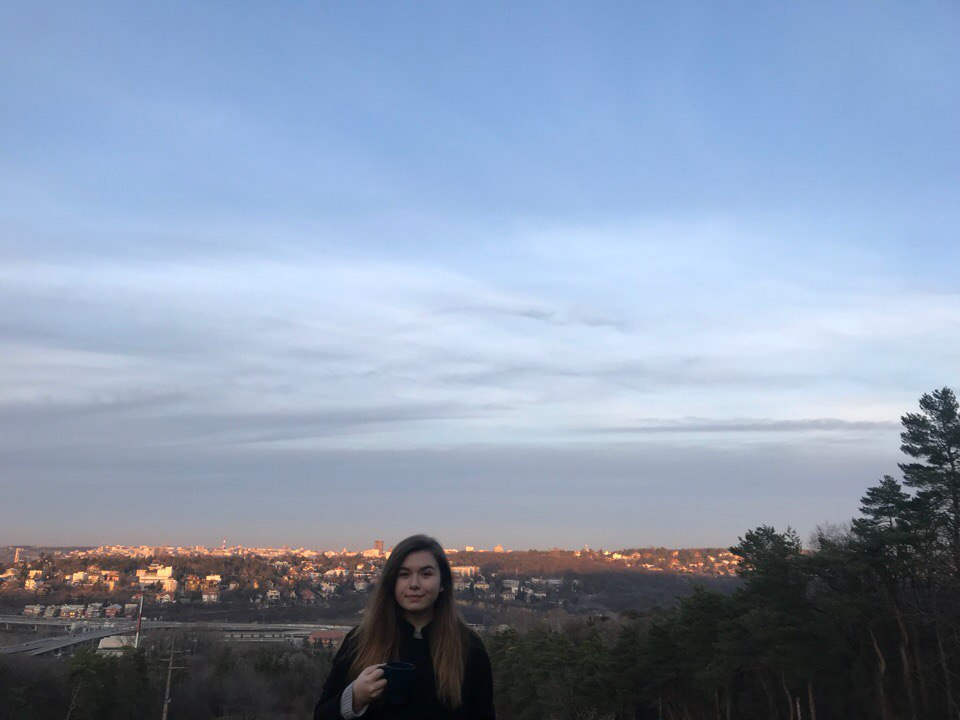
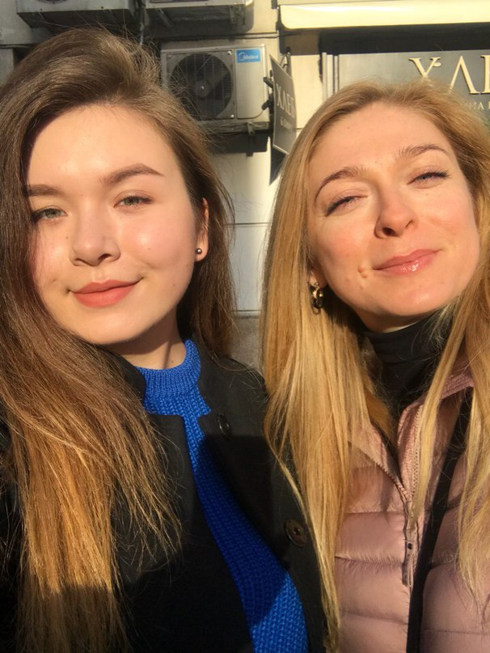

# Гафурова Алсу Ринатовна
* __Дата рождения:__ 09.08.1999
* __Место рождения:__ г. Москва
* __Номер телефона:__ 89251081555
* __Эл.почта:__ <kindmithra@gmail.com>
## *__О себе:__*

Я всю жизнь прожила в Москве с родителями и после окончания школы, очень неожиданно для себя, оказалась в ВШЭ.

Мои друзья знают,почему я выбрала Лингвистическое направление,но позвольте поделится с теми,кто со мной не так близко знаком.

1. Мне хочется пообщаться с большим количеством людей с разных концов света.
2. Языки и все из них вытекающие-единсвтенное,что мне удется хорошо.
3. Как часть своей будущей профессии я хочу путешествовать.
4. ~~Позлить папу,потому что он хотел,чтобы я пошла на Юрфак.~~

### _Увлечения и Хобби:_

Поскольку путешествия - не самое дешевое хобби, я исследовала разные страны с моими родителями. Например, вот фотографии с поездки в Сербию с моей мамой. 

 

 
В своё свободное время очень люблю смотреть фильмы и сериалы, читать. Позвольте поделиться небольшим списком избранного :)

** Сериалы**
    * "Теория большого взрыва"
    * "Друзья"
    * "Игра Престолов"

** Фильмы**
    * "Девушка из Дании"
    * "Труп невесты""
    * "Я-начало"

** Книги**
    * Мастер и Маргарита
    * Ночь Нежна

Поскольку большинство времени я провожу на учебе,вот расписание на первые три учебних дня.

| Понедельник                 | Вторник         | Среда         |
|:---------------------------:|:---------------:|:-------------:|
| Практика речи               | Практика речи   |Латынь         |
| Практика речи               | окно            |Видео          |
| окно                        | Итальянский     |Грамматика     |
| Цифровая грамотность лекция | Грамматика      |               |
| Цифровая грамотность семинар| НИС             |               |

Так же вы можете меня найти в сети VK:__ <https://vk.com/kindmithra> 

Спасибо большое за внимание, надеюсь, было интересно!

# Конец
